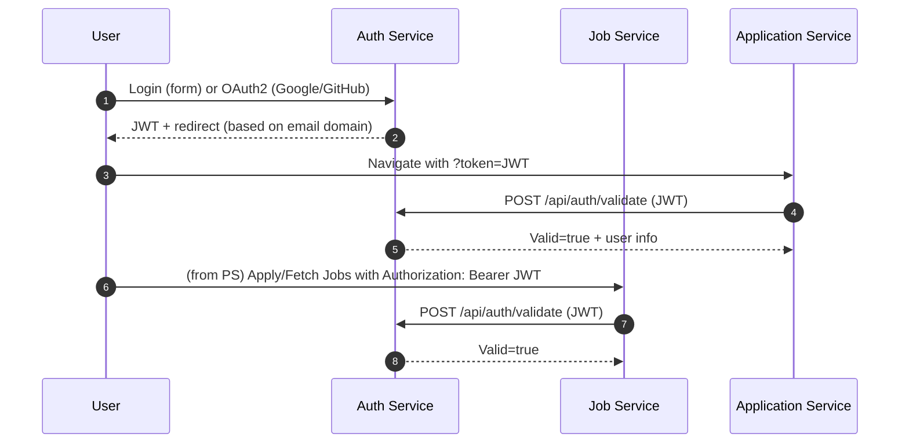
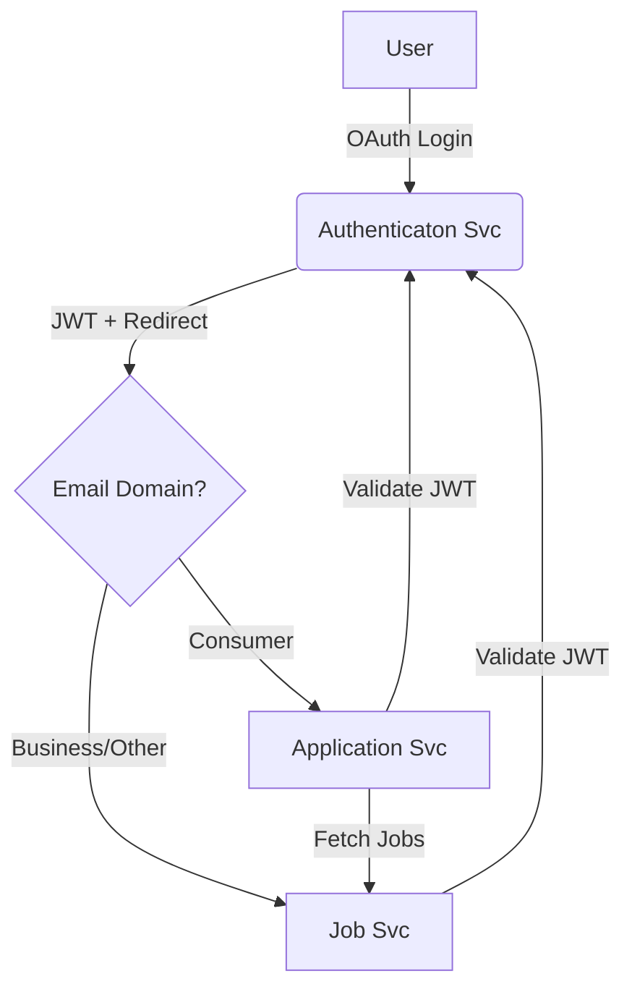

# Job Portal Microservices System

## 📋 Table of Contents

- [Project Overview](#-project-overview)
- [System Architecture](#️-system-architecture)
- [Services Overview](#-services-overview)
- [Authentication Service (Port 8083)](#-authentication-service-port-8083)
- [Job Service (Port 8081)](#-job-service-port-8081)
- [Application Service (Port 8082)](#-application-service-port-8082)
- [Inter-Service Communication Flow](#-inter-service-communication-flow)
- [API Documentation](#-api-documentation)
- [Database Schema](#️-database-schema)
- [Setup & Installation](#-setup--installation)
- [User Workflows](#-user-workflows)
- [Security Implementation](#-security-implementation)
- [Troubleshooting](#-troubleshooting)
- [Development Guidelines](#-development-guidelines)

## 🎯 Project Overview

The **Job Portal Microservices System** is a comprehensive, enterprise-grade job application platform built using Spring Boot microservices architecture. This system demonstrates modern software engineering practices with JWT-based authentication, RESTful APIs, and independent service deployment.

### Key Features

- **Multi-role Support**: Separate experiences for Job Seekers and Employers
- **Authentication**:
  - OAuth2 login with **Google** and **GitHub** (via Authentication service)
  - JWT issued post-login, used across services for authorization
  - Domain-based redirect after OAuth: consumer domains (gmail/outlook/hotmail/yahoo) → Application; others → Job
  - Cross-service token validation through the Authentication service
  - Token propagation during navigation via `?token=` URL param and localStorage
- **Inter-Service Communication**: RESTful calls (Application ↔ Job; all ↔ Authentication)
- **Scalable Architecture**: Independently deployable Spring Boot services
- **Modern UI**: Thymeleaf-based, responsive pages per service
- **Security**: Spring Security with role-based access control

### Technology Stack

| Component          | Technology             | Version     |
| ------------------ | ---------------------- | ----------- |
| **Framework**      | Spring Boot            | 3.5.5       |
| **Language**       | Java                   | 21          |
| **Security**       | Spring Security + JWT  | JJWT 0.11.5 |
| **Database**       | MySQL                  | 8.0+        |
| **ORM**            | Hibernate/JPA          | -           |
| **Build Tool**     | Maven                  | 3.6+        |
| **Frontend**       | Thymeleaf + HTML5/CSS3 | -           |
| **Authentication** | OAuth2 + JWT           |             |

## 📦 Dependencies & Their Functions

This project uses a comprehensive set of dependencies to build a robust microservices architecture. Below is a detailed breakdown of each dependency and its specific function in the system.

### 🔧 Core Spring Boot Dependencies

#### **Spring Boot Starter Parent (3.5.5)**

- **Function**: Provides dependency management and default configurations for Spring Boot
- **Usage**: Base parent POM that manages versions of all Spring Boot dependencies
- **Benefits**: Ensures compatible versions across all Spring Boot components

#### **Spring Boot Starter Web**

- **Function**: Web development framework for creating REST APIs and web applications
- **Usage**: Core dependency for all three services
- **Features**:
  - Embedded Tomcat server
  - Spring MVC framework
  - JSON serialization/deserialization
  - HTTP request/response handling

#### **Spring Boot Starter Data JPA**

- **Function**: Data persistence layer using Hibernate and JPA
- **Usage**: Database operations in all services
- **Features**:
  - Entity mapping and relationships
  - JPQL and Criteria API
  - Repository pattern implementation
  - Automatic schema generation

#### **Spring Boot Starter Validation**

- **Function**: Bean validation for request/response validation
- **Usage**: Input validation across all REST endpoints
- **Features**:
  - Annotation-based validation (@NotNull, @Email, @Size)
  - Custom validation constraints
  - Automatic error message generation

#### **Spring Boot Starter Thymeleaf**

- **Function**: Server-side template engine for web UI
- **Usage**: Rendering HTML pages in all services
- **Features**:
  - Dynamic content rendering
  - Form binding and processing
  - Template inheritance and fragments

### 🔐 Security Dependencies

#### **Spring Boot Starter Security**

- **Function**: Comprehensive security framework
- **Usage**: Authentication and authorization across all services
- **Features**:
  - HTTP security configuration
  - Method-level security
  - CORS handling
  - Security filter chain

#### **Spring Boot Starter OAuth2 Authorization Server**

- **Function**: OAuth2 authorization server capabilities
- **Usage**: Enhanced authentication features in Authentication Service
- **Features**:
  - OAuth2 token generation
  - Client registration
  - Authorization code flow

#### **Spring Boot Starter OAuth2 Client**

- **Function**: OAuth2 client capabilities
- **Usage**: Service-to-service authentication
- **Features**:
  - OAuth2 token consumption
  - Client credentials flow
  - Resource server integration

#### **Spring Boot Starter OAuth2 Resource Server**

- **Function**: Resource server for token validation
- **Usage**: Protecting endpoints with OAuth2 tokens
- **Features**:
  - JWT token validation
  - Token introspection
  - Resource protection

#### **Thymeleaf Extras Spring Security 6**

- **Function**: Thymeleaf integration with Spring Security
- **Usage**: Security-aware template rendering
- **Features**:
  - Security context access in templates
  - Conditional rendering based on authentication
  - CSRF token handling

### 🔑 JWT (JSON Web Token) Dependencies

#### **JJWT API (0.11.5)**

- **Function**: JWT API interfaces and core functionality
- **Usage**: JWT token creation and parsing
- **Features**:
  - Token structure definition
  - Claims management
  - Signature algorithms

#### **JJWT Implementation (0.11.5)**

- **Function**: Concrete implementation of JWT functionality
- **Usage**: Runtime JWT operations
- **Features**:
  - Token generation
  - Token parsing and validation
  - Cryptographic operations

#### **JJWT Jackson (0.11.5)**

- **Function**: JSON processing integration for JWT
- **Usage**: JWT payload serialization/deserialization
- **Features**:
  - JSON to JWT claims conversion
  - Custom serializers/deserializers
  - Date handling for JWT timestamps

### ☁️ Microservices Dependencies

#### **Spring Cloud Starter OpenFeign**

- **Function**: Declarative HTTP client for inter-service communication
- **Usage**: Service-to-service REST API calls
- **Features**:
  - Interface-based client generation
  - Load balancing integration
  - Fallback and circuit breaker support
  - Request/response interceptors

#### **Spring Cloud Dependencies (2025.0.0)**

- **Function**: Dependency management for Spring Cloud components
- **Usage**: Version alignment for cloud-native features
- **Features**:
  - Service discovery
  - Configuration management
  - Circuit breakers

### 🗄️ Database Dependencies

#### **MySQL Connector/J**

- **Function**: JDBC driver for MySQL database connectivity
- **Usage**: Database connection in all services
- **Features**:
  - Connection pooling
  - Transaction management
  - Performance optimizations
  - SSL support

### 🛠️ Development & Utility Dependencies

#### **Spring Boot DevTools**

- **Function**: Development-time enhancements
- **Usage**: Hot reloading and development productivity
- **Features**:
  - Automatic application restart
  - Live reload of static resources
  - Property defaults for development
  - Remote debugging support

#### **Project Lombok**

- **Function**: Code generation library to reduce boilerplate
- **Usage**: Entity classes, DTOs, and service classes
- **Features**:
  - `@Data` - generates getters, setters, toString, equals, hashCode
  - `@Entity` - JPA entity boilerplate
  - `@Builder` - builder pattern implementation
  - `@Slf4j` - logging setup

### 🧪 Testing Dependencies

#### **Spring Boot Starter Test**

- **Function**: Comprehensive testing framework
- **Usage**: Unit and integration testing
- **Included Libraries**:
  - **JUnit 5**: Testing framework with assertions and test lifecycle
  - **Mockito**: Mocking framework for unit tests
  - **AssertJ**: Fluent assertions library
  - **TestContainers**: Integration testing with real databases
  - **Spring Test**: Spring-specific testing utilities

#### **Spring Security Test**

- **Function**: Testing utilities for security components
- **Usage**: Testing authentication and authorization
- **Features**:
  - Mock authentication contexts
  - Security test annotations
  - JWT token testing utilities

### 📋 Service-Specific Dependency Usage

| Dependency          | Authentication Service | Job Service            | Application Service         |
| ------------------- | ---------------------- | ---------------------- | --------------------------- |
| **Spring Web**      | ✅ REST APIs + UI      | ✅ REST APIs + UI      | ✅ REST APIs + UI           |
| **Spring Data JPA** | ✅ User management     | ✅ Job data            | ✅ Application data         |
| **Spring Security** | ✅ Core auth logic     | ✅ Endpoint protection | ✅ Endpoint protection      |
| **JWT Libraries**   | ✅ Token generation    | ✅ Token validation    | ✅ Token validation         |
| **OpenFeign**       | ✅ (Future use)        | ✅ Auth service calls  | ✅ Auth + Job service calls |
| **Thymeleaf**       | ✅ Login/Register UI   | ✅ Employer dashboard  | ✅ Job seeker dashboard     |
| **MySQL Connector** | ✅ User database       | ✅ Job database        | ✅ Application database     |

### 🔄 Dependency Interaction Flow

```
Frontend (Thymeleaf) → Spring Web → Spring Security → JWT Validation
                                        ↓
Spring Data JPA → MySQL Connector → Database Operations
                                        ↓
OpenFeign → Service-to-Service Communication → Authentication Validation
```

### 📊 Build Configuration

#### **Maven Compiler Plugin**

- **Function**: Compiles Java source code with annotation processing
- **Configuration**: Lombok annotation processor for code generation

#### **Spring Boot Maven Plugin**

- **Function**: Packages application as executable JAR
- **Features**:
  - Fat JAR creation with embedded server
  - Development-time application running
  - Dependency exclusions (Lombok from runtime)

## 🏗️ System Architecture

### Microservices Design Pattern

```mermaid
flowchart LR
  subgraph AuthSvc[Authentication Service (8083)]
    A1[Login/Register UI]
    A2[OAuth2 (Google/GitHub)]
    A3[JWT Issuance + Validation]
  end

  subgraph JobSvc[Job Service (8081)]
    J1[Employer UI]
    J2[Jobs API]
  end

  subgraph AppSvc[Application Service (8082)]
    P1[Job Seeker UI]
    P2[Applications API]
  end

  A3 <-- Validate Token --> J2
  A3 <-- Validate Token --> P2
  P2 <-- Fetch Jobs --> J2

  A2 --> A3
  A3 -->|JWT + domain-based redirect| P1
  A3 -->|JWT + domain-based redirect| J1
```

### Service Independence Benefits

- **Scalability**: Each service can be scaled based on demand
- **Technology Flexibility**: Services can use different tech stacks
- **Fault Isolation**: Service failures don't cascade to others
- **Independent Deployment**: Update services without affecting others

## 📊 Services Overview

### Service Distribution

| Service            | Port | Database                    | Primary Function         | User Role   |
| ------------------ | ---- | --------------------------- | ------------------------ | ----------- |
| **Authentication** | 8083 | `job_portal_auth_db`        | User management & JWT    | All Users   |
| **Job**            | 8081 | `job_portal_job_db`         | Job posting & management | Employers   |
| **Application**    | 8082 | `job_portal_application_db` | Application tracking     | Job Seekers |

### Communication Matrix

- **Authentication Service**: Provides token validation to all services
- **Job Service**: Supplies job data to Application Service
- **Application Service**: Manages applications and fetches job details

## 🔐 Authentication Service (Port 8083)

### Core Functions

The Authentication Service serves as the central identity management system, handling user registration, login, and token validation across the entire platform.

### Key Components & Files

#### **Main Application Class**

- **File**: `AuthenticationApplication.java`
- **Function**: Spring Boot application entry point with `@SpringBootApplication`
- **Purpose**: Initializes the authentication service with all configurations

#### **Security Configuration**

- **File**: `SecurityConfig.java`
- **Function**: Configures Spring Security
- **Features**:
  - OAuth2 Login (`/oauth2/authorization/{google|github}`)
  - Custom OAuth2 success handler (domain-based redirect + JWT issuance)
  - Public UI routes (`/login`, `/register`) and auth APIs under `/api/auth/**`
  - Stateless session, CORS and headers configuration

#### **JWT Utility**

- **File**: `JwtUtil.java`
- **Function**: Handles JWT token generation, validation, and parsing
- **Operations**:
  - Generate tokens with user information
  - Extract claims from tokens
  - Validate token expiration and signature
  - Parse user details from tokens

#### **User Entity**

- **File**: `User.java`
- **Structure**:
  ```java
  @Entity
  public class User implements UserDetails {
      @Id @GeneratedValue private Long id;
      @Column(unique = true) private String email;
      private String password; // BCrypt encrypted
      private String name;
      @Enumerated private UserType userType; // EMPLOYER/JOB_SEEKER
      private Long externalUserId; // Reference to other services
      private String companyName; // For employers
  }
  ```

#### **Authentication Controller**

- **File**: `AuthController.java`
- **Endpoints**:
  - `POST /api/auth/register` - User registration
  - `POST /api/auth/login` - User authentication
  - `POST /api/auth/validate` - Token validation
- **Features**: Input validation, error handling, response formatting

#### **Authentication Service**

- **File**: `AuthService.java`
- **Functions**:
  - User registration with password encryption
  - Login authentication with JWT generation
  - Token validation with user information retrieval
  - Password encoding using BCrypt

#### **User Repository**

- **File**: `UserRepository.java`
- **Interface**: Extends `JpaRepository<User, Long>`
- **Queries**: Custom finder methods for user lookup

#### **Web Controller**

- **File**: `WebController.java`
- **Purpose**: Handles web page routing for authentication UI
- **Templates**: login.html, register.html, dashboard.html

#### **OAuth2 Success Handler**

- **File**: `OAuth2SuccessHandler.java`
- **Function**: After OAuth login, determines email domain and:
  - Creates/updates user if needed
  - Issues a JWT
  - Redirects to Application (8082) or Job (8081) with `?token=...`

### Service Workflow

1. **Registration**: User submits details → Password encrypted → User saved → Success response
2. **Login**: Credentials validated → JWT generated → Token returned
3. **Validation**: Token received → Signature verified → User details extracted → Validation response

## 💼 Job Service (Port 8081)

### Core Functions

The Job Service manages all job-related operations, providing employers with tools to post, update, and manage job listings while offering public access to job browsing.

### Key Components & Files

#### **Main Application Class**

- **File**: `JobApplication.java`
- **Function**: Spring Boot application with `@EnableFeignClients`
- **Purpose**: Enables communication with other services via Feign

#### **Job Entity**

- **File**: `Job.java`
- **Structure**:
  ```java
  @Entity
  public class Job {
      @Id @GeneratedValue private Long jobId;
      private String title, description, location, company;
      private Double salaryMin, salaryMax;
      @Enumerated private JobStatus status; // OPEN/CLOSED
      private Long employerId;
      private LocalDate postedDate;
  }
  ```

#### **Job Controller**

- **File**: `JobController.java`
- **Endpoints**:
  - `GET /api/jobs` - Public job browsing
  - `POST /api/jobs` - Create job (Employer)
  - `PUT /api/jobs/{id}` - Update job (Employer)
  - `DELETE /api/jobs/{id}` - Delete job (Employer)
- **Features**: Authentication validation, employer authorization

#### **Job Service**

- **File**: `JobService.java`
- **Functions**:
  - Job creation with employer validation
  - Job updates with ownership verification
  - Job search and filtering
  - Application count retrieval

#### **Authentication Client**

- **File**: `AuthServiceClient.java`
- **Purpose**: Communicates with Authentication Service for token validation
- **Methods**: Validate tokens, retrieve user information

#### **Web Controller**

- **File**: `WebController.java`
- **Purpose**: Handles employer dashboard and job management UI
- **Templates**: dashboard.html, create-job.html, job-listings.html

### Service Workflow

1. **Job Creation**: Employer authenticated → Job data validated → Job saved → Success response
2. **Job Browsing**: Public access → Jobs retrieved → Formatted response
3. **Job Management**: Employer authenticated → Ownership verified → Operation performed

## 📋 Application Service (Port 8082)

### Core Functions

The Application Service handles job applications, tracking application status, and providing job seekers with application management tools.

### Key Components & Files

#### **Main Application Class**

- **File**: `Application.java`
- **Function**: Spring Boot application with `@EnableFeignClients`
- **Purpose**: Enables inter-service communication

#### **Application Entity**

- **File**: `JobApplication.java`
- **Structure**:
  ```java
  @Entity
  public class JobApplication {
      @Id @GeneratedValue private Long applicationId;
      private Long jobId, applicantId;
      private String coverLetter;
      @Enumerated private ApplicationStatus status; // APPLIED/SHORTLISTED/etc.
      private LocalDate appliedDate;
  }
  ```

#### **Application Controller**

- **File**: `ApplicationController.java`
- **Endpoints**:
  - `POST /api/applications` - Apply to job
  - `GET /api/applications/my-applications` - Get user's applications
  - `PUT /api/applications/{id}/status` - Update status (Employer)
- **Features**: Authentication, authorization, data validation

#### **Application Service**

- **File**: `JobApplicationService.java`
- **Functions**:
  - Application creation with duplicate prevention
  - Status updates with permission checks
  - Application retrieval with job details

#### **Service Clients**

- **Files**: `AuthServiceClient.java`, `JobServiceClient.java`
- **Purpose**:
  - Auth client: Token validation and user info
  - Job client: Fetch job details for applications

#### **Web Controller**

- **File**: Handles job seeker UI routing
- **Templates**: dashboard.html, browse-jobs.html, my-applications.html

### Service Workflow

1. **Job Application**: User authenticated → Application created → Job details fetched → Success response
2. **Application Tracking**: User authenticated → Applications retrieved → Job info enriched → Response formatted
3. **Status Updates**: Employer authenticated → Permissions verified → Status updated

## 🔄 Inter-Service Communication Flow

### Authentication Flow



### Job Application Flow

```
Job Seeker Browses Jobs → Job Service (Public)
    ↓
Selects Job → Applies via Application Service
    ↓
Application Service → Validates Token with Auth Service
    ↓
Fetches Job Details → From Job Service
    ↓
Creates Application → Saves to Database
    ↓
Success Response → Job Seeker Dashboard Updated
```

### Employer Management Flow

```
Employer Logs In → Authentication Service
    ↓
Accesses Dashboard → Job Service
    ↓
Creates Job Posting → Job Service Database
    ↓
Views Applications → Application Service Queries
    ↓
Updates Status → Application Service Database
```

## 📚 API Documentation

All services support JWT-based authentication with HTTP cookies for seamless page reloads and navigation persistence.

### 🔐 Authentication Service (Port 8083)

Base URL: `http://localhost:8083`

#### **Web Pages (UI Routes)**

```http
GET  /                          # Home (redirects to login)
GET  /login                     # Login page
GET  /register                  # Registration page
```

#### **REST API Endpoints**

```http
POST /api/auth/register         # Register new user
POST /api/auth/login            # Authenticate user
POST /api/auth/validate         # Validate JWT token
```

#### **Request/Response Examples**

**User Registration (JSON):**

```json
POST /api/auth/register
{
  "email": "user@example.com",
  "password": "SecurePass123!",
  "name": "John Doe",
  "userType": "JOB_SEEKER" // or "EMPLOYER"
}
}

Response:
{
  "token": "eyJhbGciOiJIUzI1NiJ9...",
  "email": "user@example.com",
  "name": "John Doe",
  "userType": "JOB_SEEKER",
  "userId": 1
}
```

**User Login:**

```json
POST /api/auth/login
{
  "email": "user@example.com",
  "password": "SecurePass123!"
}

Response:
{
  "token": "eyJhbGciOiJIUzI1NiJ9...",
  "email": "user@example.com",
  "name": "John Doe",
  "userType": "JOB_SEEKER",
  "userId": 1
}
```

### 💼 Job Service (Port 8081)

Base URL: `http://localhost:8081`

#### **Web Pages (UI Routes)**

```http
GET  /                          # Home (redirects to dashboard)
GET  /login-redirect            # Login redirect page
GET  /dashboard                 # Employer dashboard
GET  /job-listings              # Employer's job listings
GET  /jobs                      # Public job browsing (alias)
GET  /create-job                # Create/edit job form
GET  /job-details               # Job details page
GET  /debug                     # Debug information page
```

#### **Public API Endpoints (No Authentication Required)**

```http
GET  /api/jobs                  # Browse all public jobs
GET  /api/jobs/all              # Get all jobs (alias)
GET  /api/jobs/{jobId}          # Get specific job details
```

#### **Protected API Endpoints (Authentication Required)**

```http
# Job Management (Employers)
POST   /api/jobs                # Create new job posting
PUT    /api/jobs/{jobId}        # Update existing job
DELETE /api/jobs/{jobId}        # Delete job posting
GET    /api/jobs/my-jobs        # Get employer's jobs

# Employer-specific
GET    /api/employers/{employerId}/jobs    # Get jobs by employer

# Application Management (Cross-service)
GET    /api/jobs/{jobId}/applications      # Get job applications
PUT    /api/applications/{applicationId}/status  # Update application status
```

#### **Request/Response Examples**

**Create Job:**

```json
POST /api/jobs
Headers: Authorization: Bearer {token}
{
  "title": "Software Developer",
  "description": "Full-stack developer position...",
  "location": "New York, NY",
  "company": "Tech Corp",
  "salaryMin": 70000.00,
  "salaryMax": 90000.00,
  "status": "OPEN"
}

Response:
{
  "jobId": 1,
  "title": "Software Developer",
  "description": "Full-stack developer position...",
  "location": "New York, NY",
  "company": "Tech Corp",
  "salaryMin": 70000.00,
  "salaryMax": 90000.00,
  "postedDate": "2025-09-10",
  "status": "OPEN",
  "employerId": 1
}
```

### 📋 Application Service (Port 8082)

Base URL: `http://localhost:8082`

#### **Web Pages (UI Routes)**

```http
GET  /                          # Home (redirects to dashboard)
GET  /dashboard                 # Job seeker dashboard
GET  /browse-jobs               # Browse available jobs
GET  /my-applications           # View user's applications
GET  /profile                   # Job seeker profile
GET  /job-details               # Job details and application
```

#### **Protected API Endpoints (Authentication Required)**

```http
# Application Management
POST   /api/applications        # Submit job application
POST   /api/applications/apply  # Alternative apply endpoint
PUT    /api/applications/{applicationId}         # Update application
DELETE /api/applications/{applicationId}         # Withdraw application
GET    /api/applications/{applicationId}         # Get specific application

# Application Retrieval
GET    /api/applications/my-applications         # Get user's applications
GET    /api/applicants/{applicantId}/applications  # Get applicant's applications
GET    /api/jobs/{jobId}/applications            # Get applications for job

# Application Status (Employers)
PUT    /api/applications/{applicationId}/status  # Update application status

# Profile Management
GET    /api/profile                             # Get user profile
PUT    /api/profile                             # Update user profile

# Debug Endpoints
GET    /api/debug/applications                  # Debug applications
GET    /api/debug/auth                         # Debug authentication
```

#### **Request/Response Examples**

**Submit Application:**

```json
POST /api/applications
Headers: Authorization: Bearer {token}
{
  "jobId": 1,
  "coverLetter": "I am very interested in this position...",
  "resumeUrl": "https://example.com/resume.pdf"
}

Response:
{
  "applicationId": 1,
  "jobId": 1,
  "applicantId": 2,
  "coverLetter": "I am very interested in this position...",
  "resumeUrl": "https://example.com/resume.pdf",
  "status": "APPLIED",
  "appliedDate": "2025-09-10"
}
```

**Get User Applications:**

```json
GET /api/applications/my-applications
Headers: Authorization: Bearer {token}

Response:
[
  {
    "applicationId": 1,
    "jobId": 1,
    "jobTitle": "Software Developer",
    "company": "Tech Corp",
    "status": "APPLIED",
    "appliedDate": "2025-09-10",
    "coverLetter": "I am very interested...",
    "resumeUrl": "https://example.com/resume.pdf"
  }
]
```

### 🔄 Inter-Service Communication

The services communicate via REST APIs with the following patterns:

#### **Authentication Flow**

1. User logs in through Authentication Service → Receives JWT token
2. Token included in subsequent requests to Job/Application services
3. Services validate token with Authentication Service via `/api/auth/validate`

#### **Job Application Flow**

1. Job Seeker browses jobs on Application Service
2. Application Service fetches job data from Job Service
3. Application submitted through Application Service
4. Job Service queries Application Service for application data

#### **Cross-Service Endpoints**

**Job Service ↔ Application Service:**

```http
# Job Service calls Application Service
GET  {APPLICATION_SERVICE}/api/jobs/{jobId}/applications

# Application Service calls Job Service
GET  {JOB_SERVICE}/api/jobs/{jobId}
GET  {JOB_SERVICE}/api/jobs
```

**All Services ↔ Authentication Service:**

```http
POST {AUTH_SERVICE}/api/auth/validate
```

### 🔐 Authentication & Security

#### **JWT Token Format**

- **Header**: `Authorization: Bearer {token}`
- **Cookie**: `authToken={token}` (for page reload persistence)
- **Query Parameter**: `?token={token}` (for navigation links)

#### **Token Claims**

```json
{
  "sub": "user@example.com",
  "userId": 1,
  "userType": "JOB_SEEKER",
  "iat": 1757444864,
  "exp": 1757531264
}
```

#### **Security Features**

- ✅ **JWT Authentication**: Stateless token-based authentication
- ✅ **HTTP Cookies**: Automatic cookie setting for page reload persistence
- ✅ **CORS Support**: Cross-origin request handling
- ✅ **Role-based Access**: Separate endpoints for Employers/Job Seekers
- ✅ **Token Validation**: Real-time token verification across services
- ✅ **Secure Headers**: Proper security headers configuration

### 📊 HTTP Status Codes

| Code | Meaning               | Usage                             |
| ---- | --------------------- | --------------------------------- |
| 200  | OK                    | Successful requests               |
| 201  | Created               | Resource created successfully     |
| 400  | Bad Request           | Invalid request data              |
| 401  | Unauthorized          | Missing or invalid authentication |
| 403  | Forbidden             | Access denied for resource        |
| 404  | Not Found             | Resource not found                |
| 409  | Conflict              | Resource already exists           |
| 500  | Internal Server Error | Server processing error           |

## 🗄️ Database Schema

### Authentication Database (`job_portal_auth_db`)

```sql
CREATE TABLE users (
    id BIGINT PRIMARY KEY AUTO_INCREMENT,
    email VARCHAR(255) UNIQUE NOT NULL,
    password VARCHAR(255) NOT NULL,
    name VARCHAR(255) NOT NULL,
    user_type ENUM('EMPLOYER', 'APPLICANT') NOT NULL,
    external_user_id BIGINT,
    company_name VARCHAR(255),
    created_at TIMESTAMP DEFAULT CURRENT_TIMESTAMP,
    updated_at TIMESTAMP DEFAULT CURRENT_TIMESTAMP ON UPDATE CURRENT_TIMESTAMP
);
```

### Job Database (`job_portal_job_db`)

```sql
CREATE TABLE jobs (
    job_id BIGINT PRIMARY KEY AUTO_INCREMENT,
    title VARCHAR(255) NOT NULL,
    description TEXT NOT NULL,
    location VARCHAR(255) NOT NULL,
    company VARCHAR(255) NOT NULL,
    salary_min DECIMAL(10,2),
    salary_max DECIMAL(10,2),
    posted_date DATE DEFAULT CURRENT_DATE,
    status ENUM('OPEN', 'CLOSED') DEFAULT 'OPEN',
    employer_id BIGINT NOT NULL,
    created_at TIMESTAMP DEFAULT CURRENT_TIMESTAMP,
    updated_at TIMESTAMP DEFAULT CURRENT_TIMESTAMP ON UPDATE CURRENT_TIMESTAMP
);
```

### Application Database (`job_portal_application_db`)

```sql
CREATE TABLE job_applications (
    application_id BIGINT PRIMARY KEY AUTO_INCREMENT,
    job_id BIGINT NOT NULL,
    applicant_id BIGINT NOT NULL,
    cover_letter TEXT,
    status ENUM('APPLIED', 'SHORTLISTED', 'REJECTED', 'HIRED') DEFAULT 'APPLIED',
    applied_date DATE DEFAULT CURRENT_DATE,
    created_at TIMESTAMP DEFAULT CURRENT_TIMESTAMP,
    updated_at TIMESTAMP DEFAULT CURRENT_TIMESTAMP ON UPDATE CURRENT_TIMESTAMP,
    UNIQUE KEY unique_job_applicant (job_id, applicant_id)
);
```

## 🚀 Setup & Installation

### Prerequisites

- **Java**: OpenJDK 21 or higher
- **Maven**: 3.6+ for dependency management
- **MySQL**: 8.0+ database server
- **Git**: For version control

### Database Setup

```sql
-- Create databases
CREATE DATABASE job_portal_auth_db;
CREATE DATABASE job_portal_job_db;
CREATE DATABASE job_portal_application_db;

-- Create user (optional)
CREATE USER 'jobportal'@'localhost' IDENTIFIED BY 'password';
GRANT ALL PRIVILEGES ON job_portal_*.* TO 'jobportal'@'localhost';
```

### Service Configuration

Add a `.env` file at repo root (or environment variables) and the services will auto-import it:

```
# ====== Authentication (8083) ======
AUTH_DB_URL=jdbc:mysql://localhost:3306/job_portal_auth_db?createDatabaseIfNotExist=true&useSSL=false&serverTimezone=UTC
AUTH_DB_USERNAME=root
AUTH_DB_PASSWORD=
JWT_SECRET=change-me-32b-min
JWT_EXPIRATION=86400000
GOOGLE_CLIENT_ID=
GOOGLE_CLIENT_SECRET=
GITHUB_CLIENT_ID=
GITHUB_CLIENT_SECRET=

# ====== Application (8082) ======
APP_DB_URL=jdbc:mysql://localhost:3306/job_portal_application_db?createDatabaseIfNotExist=true&useSSL=false&serverTimezone=UTC
APP_DB_USERNAME=root
APP_DB_PASSWORD=
APP_JWT_SECRET=change-me-32b-min
APP_JWT_EXPIRATION=86400000

# ====== Job (8081) ======
JOB_DB_URL=jdbc:mysql://localhost:3306/job_portal_job_db?createDatabaseIfNotExist=true&useSSL=false&serverTimezone=UTC
JOB_DB_USERNAME=root
JOB_DB_PASSWORD=
JOB_JWT_SECRET=change-me-32b-min
JOB_JWT_EXPIRATION=86400000
```

Notes:

- OAuth redirect URIs:
  - Google: `http://localhost:8083/login/oauth2/code/google`
  - GitHub: `http://localhost:8083/login/oauth2/code/github`
- Services already import `.env` and `../.env` via `spring.config.import`.

```properties
spring.datasource.username=your_username
spring.datasource.password=your_password
spring.datasource.url=jdbc:mysql://localhost:3306/database_name
```

### Startup & Run

```bash
# Terminal 1: Authentication Service (start first)
cd Authentication && mvn spring-boot:run

# Terminal 2: Job Service
cd Job && mvn spring-boot:run

# Terminal 3: Application Service
cd Application && mvn spring-boot:run
```

### Access URLs

- **Authentication Portal**: http://localhost:8083
- **Employer Dashboard**: http://localhost:8081/dashboard
- **Job Seeker Dashboard**: http://localhost:8082/dashboard

## 👥 User Workflows

### Job Seeker Journey

1. **Registration**: Create account as JOB_SEEKER
2. **Authentication**: Login to receive JWT token
3. **Job Discovery**: Browse available jobs
4. **Application**: Apply with cover letter
5. **Tracking**: Monitor application status
6. **Management**: View and manage applications

### Employer Journey

1. **Registration**: Create account as EMPLOYER
2. **Authentication**: Login to receive JWT token
3. **Job Posting**: Create job listings
4. **Management**: Update and manage jobs
5. **Review**: View applications for jobs
6. **Hiring**: Update application status

## 🔒 Security Implementation

### JWT Authentication Flow

1. **Token Generation**: User credentials validated → JWT created with user info
2. **Token Storage**: Client stores token in localStorage/sessionStorage
3. **Request Authorization**: Token attached to Authorization header; token passed via URL `?token=` during cross-service navigation
4. **Token Validation**: Services validate token with Authentication Service
5. **User Context**: User information extracted and made available

### Frontend Auth Helpers

- `static/js/pre-auth.js`: Handles `?token=` on first paint; stores token; hydrates user info to update sidebar.
- `static/js/auth-helper.js`: Standardizes token storage, auth checks, token injection on in-app navigation.

### Security Features

- **Password Encryption**: BCrypt hashing for secure storage
- **Strong Password Requirements**: Minimum 8 characters with uppercase, lowercase, number and special character
- **Token Expiration**: 24-hour token validity
- **Role-based Access**: Different permissions for user types
- **CORS Configuration**: Cross-origin request handling
- **Input Validation**: Comprehensive request validation

## 🐛 Troubleshooting

### Common Issues

#### Service Startup Problems

```bash
# Check Java version
java -version

# Check Maven version
mvn -version

# Verify MySQL connection
mysql -u root -p -e "SHOW DATABASES;"
```

#### Authentication Issues

- Verify Authentication Service is running on port 8083
- Check JWT token format: `Authorization: Bearer <token>`
- OAuth redirect URIs must match the provider configuration (Google/GitHub)
- On localhost, cookies are not shared across different ports; this project relies on localStorage + URL token propagation instead

#### Database Connection Issues

- Ensure MySQL is running
- Verify database credentials
- Check database existence and permissions

### Debug Tools

- **Authentication Debug**: http://localhost:8081/debug
- **Browser Console**: Check for JavaScript errors
- **Application Logs**: Review service console output

## 📂 Project File Map (High-level)

```
Job-Application-Service/
├── Authentication/
│   ├── src/main/java/com/service/authentication/
│   │   ├── config/                # Security config, OAuth2 success handler
│   │   ├── controller/            # REST + Web controllers
│   │   ├── dto/                   # DTOs for API requests/responses
│   │   ├── entity/                # JPA entities (User, UserType)
│   │   ├── repository/            # Spring Data repositories
│   │   ├── service/               # Business logic (AuthService, CustomUserDetailsService)
│   │   └── util/                  # JwtUtil
│   └── src/main/resources/
│       ├── templates/             # login.html, register.html
│       └── application.properties
│
├── Job/
│   ├── src/main/java/com/service/job/
│   │   ├── controller/            # REST + Web controllers
│   │   ├── dto/ | model/          # Job DTOs and models
│   │   ├── repository/            # Job repositories
│   │   ├── service/               # Job business logic
│   │   └── config/                # Security/auth filters if any
│   └── src/main/resources/
│       ├── templates/             # Employer UI (dashboard, create-job, listings)
│       └── static/js/             # pre-auth.js, auth-helper.js
│
├── Application/
│   ├── src/main/java/com/service/application/
│   │   ├── controller/            # REST + Web controllers
│   │   ├── dto/ | model/          # Application DTOs and models
│   │   ├── repository/            # Application repositories
│   │   ├── service/               # Application business logic
│   │   └── config/                # Request auth filters
│   └── src/main/resources/
│       ├── templates/             # Seeker UI (dashboard, browse-jobs, my-applications, profile)
│       └── static/js/             # pre-auth.js, auth-helper.js
│
└── .env.example                   # Environment variable template
```

## 🗺️ Visual Guides



